<p align="center">
  
</p>

<h1 align="center">Dotfiles & System Setup</h1>

<p align="center">
  <a href="https://nixos.org"></a>
  <a href="https://github.com/NixOS/nixpkgs"></a>
  <a href="https://github.com/nix-community/home-manager"></a>
  <a href="https://github.com/nix-darwin/nix-darwin"></a>
  <a href="LICENSE"></a>
</p>

Declarative setup for every machine I use, built on [Nix](https://nixos.org) and makes use of [home-manager](https://github.com/nix-community/home-manager), [nix-darwin](https://github.com/nix-darwin/nix-darwin), [mise-en-place](https://mise.jdx.dev/), and [Homebrew](https://brew.sh/). One command turns a fresh install into a fully-configured finished workstation; the same command re-applies the current state later.

It installs all applications and tools along with their configurations (user-level) and it deploys system services and configures system preferences and settings when applicable (system-level). The aim is to be able to quickly bootstrap any host with my identical setup as quickly and as seamslessly as possible.

| Host | Platform | Flake outputs | Also |
| --- | --- | --- | --- |
| `macbookpro` | macOS, Apple Silicon | `darwinConfigurations.macbookpro` + `homeConfigurations.murtadha` | Homebrew supplies the binaries ([`Brewfile`](Homebrew/Brewfile)) |
| `nixos-workstation` | NixOS desktop | `nixosConfigurations.nixos-workstation` (home-manager integrated) | |
| `ubuntu-vm` | Ubuntu Server, headless | `homeConfigurations."murtadha@ubuntu-vm"` | |

## Quick start

```sh
curl -sSfL https://raw.githubusercontent.com/MurtadhaInit/dotfiles/main/bootstrap.bash | bash
```

Then `mise install` and `dot`.

<p align="center">
  
</p>

[`bootstrap.bash`](bootstrap.bash) detects the platform and does the rest:

1. Installs Nix if missing (and Homebrew on macOS).
2. Clones this repo to `~/.dotfiles`, submodules included.
3. Activates the flake: nix-darwin then home-manager on macOS, home-manager on Ubuntu,
   `nixos-rebuild switch` on NixOS.
4. On macOS, installs everything in the Brewfile. App Store entries need you signed in
   to the App Store first, so on a brand-new Mac sign in and run it once more.

The repo must live at `~/.dotfiles`: several app configs are symlinked straight into
the checkout so the app can write to them at runtime (see [Layout](#layout)).

## Day to day

| Task | Command |
| --- | --- |
| Rebuild macOS system settings | `sudo darwin-rebuild switch --flake ~/.dotfiles/system-setup/nix#macbookpro` |
| Rebuild the user environment (macOS) | `home-manager switch --flake ~/.dotfiles/system-setup/nix#murtadha` |
| Rebuild the user environment (Ubuntu) | `home-manager switch --flake ~/.dotfiles/system-setup/nix#murtadha@ubuntu-vm` |
| Rebuild NixOS (system + user) | `sudo nixos-rebuild switch --flake ~/.dotfiles/system-setup/nix#nixos-workstation` |
| Update inputs | `nix flake update` in `system-setup/nix`, then rebuild |
| Snapshot current Homebrew packages into the Brewfile | `bbd` |
| Run an optional setup task | `dot` |

## Layout

```
Applications/<app>/       hand-written config per app, exactly as the app reads it
Homebrew/Brewfile         every formula, cask and App Store app on the Mac (generated by `bbd`)
system-setup/nix/         the flake
  hosts/<host>/           one directory per machine: what it imports and its overrides
  profiles/               cli.nix (every host) and gui.nix (hosts with a display)
  hm-modules/             one custom home-manager module per app
  darwin-modules/         macOS system settings, one file per topic
  nixos-modules/          NixOS system pieces, one file per app or concern
  secrets/                agenix-encrypted secrets and the keys that can open them
system-setup/*-tasks/     optional Nushell tasks, picked interactively with `dot`
```

### How an app is configured

Each app gets one module in `hm-modules/<app>.nix` exposing
`dotfiles.<app>.enable` and, where relevant, `dotfiles.<app>.installPackage`.
Profiles only set `enable` with `lib.mkDefault`; hosts decide policy. macOS, for
example, sets `installPackage = false` for anything Homebrew already provides, so
home-manager writes the config and Homebrew owns the binary. One install path per tool
per host.

The config itself is a plain file under `Applications/<app>/`, so it stays readable
and portable. A module places it one of two ways:

- **Store copy** for files the app only reads. Read-only, changes need a rebuild.
- **Out-of-store symlink** into `~/.dotfiles` for files the app rewrites at runtime
  (editors, mise, k9s) or which can be updated from the GUI. Edits land in the
  checkout immediately, no rebuild.

### Secrets

[agenix](https://github.com/ryantm/agenix) encrypts secrets to a per-host age public key
listed in [`secrets.nix`](system-setup/nix/secrets/secrets.nix); the private key lives at
`~/.ssh/keys/age.txt` on that host only. Secrets are opt-in per host, since importing
agenix commits the machine to holding a key. Currently: Syncthing identities and
purchased fonts.

### Optional tasks

`dot` opens a picker over small Nushell scripts for the things Nix does not cover:
cloning my other repos, syncing VS Code extensions, refreshing Nushell's vendor
autoload scripts, etc. Each task is a single `.nu` file which can also be run
directly with flags.

## Conventions

Working conventions and gotchas are kept in [`AGENTS.md`](AGENTS.md), readable by both agents and humans alike.
